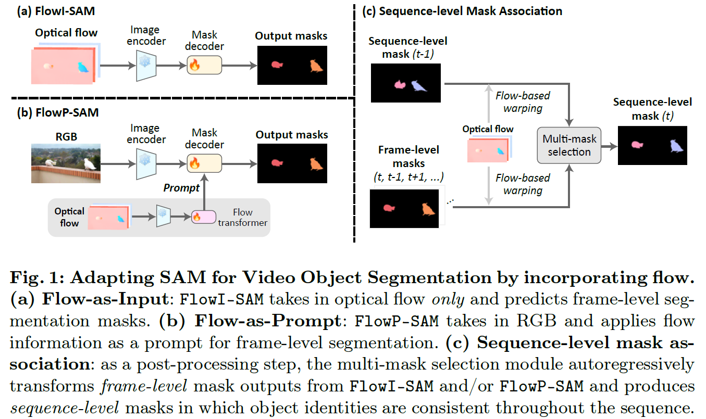

# Moving Object Segmentation: All You Need Is SAM (and Flow)

Junyu Xie, Charig Yang, Weidi Xie, Andrew Zisserman

Visual Geometry Group, Department of Engineering Science, University of Oxford

<a src="https://img.shields.io/badge/cs.CV-2404.12389-b31b1b?logo=arxiv&logoColor=red" href="https://arxiv.org/abs/2404.12389">  
</a>
<a href="https://www.robots.ox.ac.uk/~vgg/research/flowsam/" alt="Project page"> 
</a>


<p align="center">
  
</p>


## Requirements
```pytorch=2.0.0```,
```Pillow```,
```opencv```,
```einops```,
```tensorboardX```

Segment Anything can be installed following the official repository [here](https://github.com/facebookresearch/segment-anything/), or by
```
pip install git+https://github.com/facebookresearch/segment-anything.git
```

## Datasets 
#### Training datasets
* **Synthetic training data** from [OCLR_paper](https://github.com/Jyxarthur/OCLR_model) can be downloaded from [here](https://drive.google.com/drive/folders/1tmDq_vG_BvY5po40Ux5OBds1avUM_CbR?usp=sharing). 
* **DAVIS2017 (and DAVIS2016)** can be downloaded [here](https://davischallenge.org/davis2017/code.html). 
* **DAVIS2017-motion** has the same sequences with DAVIS2017, but the annotations are curated to cater for jointly moving objects, which can be downloaded from [here](https://drive.google.com/drive/folders/16zqUO1WuAp8Am4Giitc9hn2rMao6x_MA?usp=sharing).
#### Evaluation datasets
* **DAVIS datasets** can be obtained following the instructions above.
* **YTVOS2018-motion** is a subset selected from *training split* of YTVOS2018. These selected sequences are used for *evaluation*, with predominantly moving objects involved (*i.e.,* objects can be discovered based on their motion). For more details and downloading instructions, please follow [this link](https://github.com/Jyxarthur/appear-refine/?tab=readme-ov-file#the-youtubevos2018-motion-dataset).
* Other datasets such as **SegTrackv2**, **FBMS-59** and **MoCA_filter** can be downloaded and preprocessed following the protocol described in [motiongrouping](https://github.com/charigyang/motiongrouping).
#### Optical flow estimation
In this work, optical flow is estimated by [RAFT](https://github.com/princeton-vl/RAFT), with the code provided in the ```flow``` folder.
#### Path configuration
The data paths can be specified in ```data/dataset_config.py```.


## Checkpoints and results
* The pretrained original SAM checkpoints can be downloaded [here](https://github.com/facebookresearch/segment-anything/)
* The pretrained flowsam model checkpoints can be downloaded [here](https://drive.google.com/drive/folders/16I6zjJI4FCxhdGVIXgDddC5c64raKEuu?usp=sharing).
* Our predicted masks on benchmarks datasets can be found [here](https://drive.google.com/drive/folders/18dl-1_HHxlVNoav-ZNQmyZekm8JXMiAF?usp=sharing).

## Inference
To run FlowI-SAM,
```
python evaluation.py --model=flowisam --dataset=dvs16 --flow_gaps=1,-1,2,-2 \
                      --max_obj=5 --num_gridside=10 --ckpt_path={} --save_path={}
```
To run FlowP-SAM,
```
python evaluation.py --model=flowpsam --dataset=dvs16 --flow_gaps=1,-1,2,-2 \
                      --max_obj=10 --num_gridside=20 --ckpt_path={} --save_path={}
```
where ```--flow_gaps``` denotes the frame gaps of flow inputs 
<br> &nbsp;&nbsp;&nbsp;&nbsp;&nbsp;&nbsp;&nbsp;&nbsp;&nbsp;&nbsp; 
```--max_obj``` indicates the maximum number of predicted object masks
<br> &nbsp;&nbsp;&nbsp;&nbsp;&nbsp;&nbsp;&nbsp;&nbsp;&nbsp;&nbsp;
```--num_gridside``` indicates the number of uniform grid point inputs (e.g., "10" correponds to 10 x 10 points)
<br> &nbsp;&nbsp;&nbsp;&nbsp;&nbsp;&nbsp;&nbsp;&nbsp;&nbsp;&nbsp;
```--ckpt_path``` specifies the model checkpoint path
<br> &nbsp;&nbsp;&nbsp;&nbsp;&nbsp;&nbsp;&nbsp;&nbsp;&nbsp;&nbsp;
```--save_path``` specifies the path to save predicted masks (if not specified, no masks will be saved)


To run the code on your own data, (or datasets without GT multi-object segmentation, *e.g.,* SegTrackv2, FBMS-59, MoCA_filter, *etc.*)
* Set ```--dataset=example```, and arrange you data as the following:
```
{data_name}/
├── JPEGImages/
│   └── {category_name}/
│       ├── 00000.jpg
│       └── ......
├── FlowImages_gap1/
│   └── {category_name}/
│       ├── 00000.png
│       └── ......
├── ...... (More flow images)
```
* Add you own dataset information in ```config_eval_dataloader()``` in ```data/dataset_config.py``` (under "example" dataset)

To perform sequence-level mask association (in other words, matching the identities of masks throughout the sequence) for multi-object datasets,
```
python seq_level_postprocess.py --dataset=dvs17m --mask_dir={} --save_path={}
```
For single-object cases usually the first mask of each frame would suffice.


#### Evaluation benchmarks:
* For DAVIS2016, use the [DAVIS2016 official evaluator](https://github.com/fperazzi/davis).
* For DAVIS2017, use the [DAVIS2017 official evaluator](https://github.com/fperazzi/davis-2017).
* For DAVIS2017-motion, following the evaluation protocol introduced in [OCLR_paper](https://github.com/Jyxarthur/OCLR_model).
* For MoCA_filter, use the evaluator provided in [motiongrouping](https://github.com/charigyang/motiongrouping).

## Training
```
python train.py --model={} --dataset=dvs16 --model_save_path={}
```
where ```--model``` specifies the model to be trained (```flowisam``` or ```flowpsam```) 
<br> &nbsp;&nbsp;&nbsp;&nbsp;&nbsp;&nbsp;&nbsp;&nbsp;&nbsp;&nbsp; 
```--model_save_path``` indicates the path to save logs and model ckpts

## Citation
If you find this repository helpful, please consider citing our work:
```
@InProceedings{xie2024flowsam,
  title={Moving Object Segmentation: All You Need Is SAM (and Flow)},
  author={Junyu Xie and Charig Yang and Weidi Xie and Andrew Zisserman},
  booktitle={ACCV},
  year={2024}
}
```

## Reference
Segment Anything: https://github.com/facebookresearch/segment-anything


 

 
